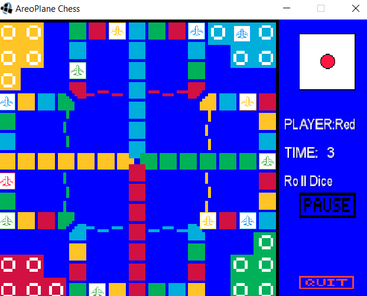
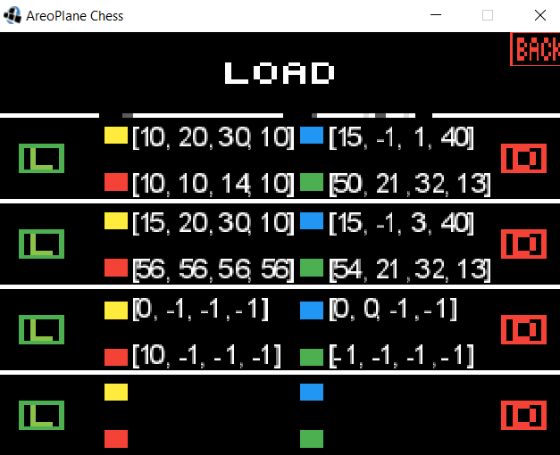

# Aeroplane-Chess
An Aeroplane chess game designed by using MVC pattern and [Libgdx framework](https://libgdx.badlogicgames.com/).<br>
Link to game rules: https://en.wikipedia.org/wiki/Aeroplane_chess.<br>

## Screens



## Controls
Player
* The user controls the red planes

Game Screen
* Click the dice to roll.
* Click the plane to move it.
* Click the pause button to pause.
* After clicking pause button, click the save button to get into the load screen.
* After clicking pause button, click the resume button to resume.
* Click the quit button to return to the main menu.

Load Screen
* Click the back button to return to the previous screen.
* Click the red button in a slot to delete the game data in that slot.
* Click the green button in a slot to load the game data from that slot or to save the current game data into that slot.

## Note
The "Games.txt" file stores the game data.<br>
The game will exit if any of the positions is less than -1 or greater than 56. The user can manually delete/edit that data in file.<br>


## Try it here 
Download the .jar here: [Desktop](out/artifacts/AreoPlane_jar/desktop-1.0.jar).<br>
```
To run it:
* command line: java -jar desktop-1.0.jar
* double click the .jar
```
